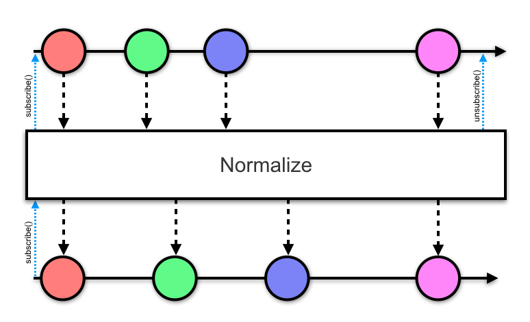

RxNormalize
===========

## NOTE

This is not maintained. I worked on this a long time ago and decided to open source it for posterity.

This approach works, but my gut feeling is that this is something that should be done via backpressure. I might try this again in the future as such.

---------

A normalizing operator for RxJava Observables.

An operator that normalizes the flow of data through an {@link Observable} stream in such a way
that it will only emit a maximum of once per specified time window. If the previous emission was
longer before than the specified window, it will emit immediately.

This is similar to `debounce` and various throttle operators, except that this will not drop or skip
any emissions. All emissions are queued if necessary.



Usage
-----

Java:
```java
myBananaObservable
  ...
  .lift(new OperatorNormalize<Banana>(1, TimeUnit.SECONDS)
  ...
```

Kotlin:
```kotlin
// Extension directly applied to Observable
myObservable
  ...
  .normalize(1, TimeUnit.SECONDS)
  ...
```

Snapshots of the development version are available in [Sonatype's snapshots repository][snapshots].

License
-------

    Copyright (C) 2016 Zac Sweers

    Licensed under the Apache License, Version 2.0 (the "License");
    you may not use this file except in compliance with the License.
    You may obtain a copy of the License at

       http://www.apache.org/licenses/LICENSE-2.0

    Unless required by applicable law or agreed to in writing, software
    distributed under the License is distributed on an "AS IS" BASIS,
    WITHOUT WARRANTIES OR CONDITIONS OF ANY KIND, either express or implied.
    See the License for the specific language governing permissions and
    limitations under the License.

 [snapshots]: https://oss.sonatype.org/content/repositories/snapshots/
